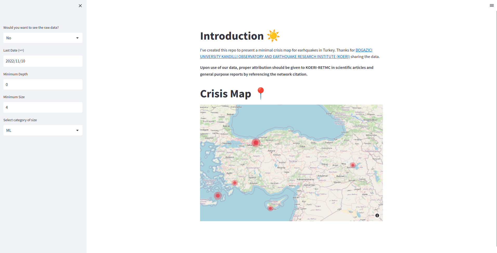
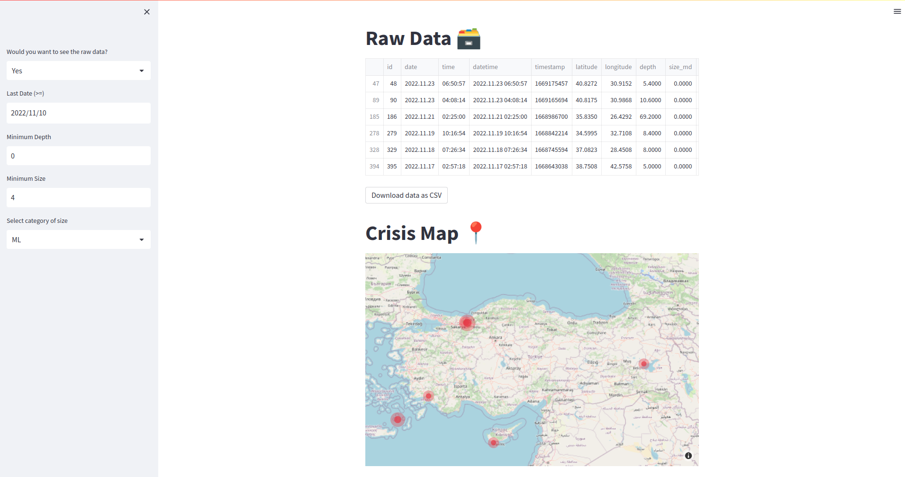

[](https://github.com/mebaysan/Turkey-Earthquake-Crisis-App/actions/workflows/ci.yml) [](https://github.com/mebaysan/Turkey-Earthquake-Crisis-App/actions/workflows/dockerhub-description.yml)


- [Introduction](#introduction)
- [Docker Image on the Hub](#docker-image-on-the-hub)
- [Manual](#manual)
- [Gallery](#gallery)

# Introduction

I've created this [repo](https://github.com/mebaysan/Turkey-Earthquake-Crisis-App) to present a minimal crisis map for earhquakes in Turkey.

You can easily run the app by using [Docker](https://docker.com).

I also created a vide on [my Youtube channel](https://www.youtube.com/BaysanSoft). You can access its documentation by using the link [here](https://gist.github.com/mebaysan/e7c6b24905727578b51c62fd56867c4c).


Thanks for [BOGAZICI UNIVERSITY KANDILLI OBSERVATORY AND EARTHQUAKE RESEARCH INSTITUTE (KOERI)](http://www.koeri.boun.edu.tr/scripts/lasteq.asp) sharing the data.

**Upon use of our data, proper attribution should be given to KOERI-RETMC in scientific articles and general purpose reports by referencing the network citation.**

# Docker Image on the Hub
Explore Image on Docker Hub: [mebaysan/turkey-earthquake-crisis-app](https://hub.docker.com/r/mebaysan/turkey-earthquake-crisis-app)

# Manual

```bash
# default running in light mode
docker run -p 8080:8080 mebaysan/turkey-earthquake-crisis-app

# for dark mode
docker run -p 8080:8080 -e STREAMLIT_THEME_BASE=dark mebaysan/turkey-earthquake-crisis-app
```

# Gallery




